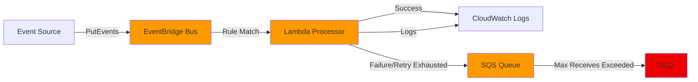

# AWS EventBridge + Lambda + SQS Starter

[](https://github.com/saranreddy/aws-eventbridge-lambda-sqs-starter/actions/workflows/ci.yml)
[](https://opensource.org/licenses/MIT)
[](https://www.terraform.io/)

**Download-and-apply AWS EventBridge + Lambda + SQS starter** (Terraform). Event in, work handled, failures durable on a queue.

A small, honest demo of an async work pattern for platform and AWS engineers: EventBridge routes custom events to a Lambda that processes them. On failure, the payload lands on an SQS queue (with DLQ) so work is not lost and can be inspected or retried.

## Who Should Use This

This starter is for backend and platform engineers building async, event-driven processing on AWS — especially teams moving side effects (emails, webhooks, enrichment) out of request paths and into background work. Common in SaaS backends, e-commerce order flows, and internal platform event buses.

**Good fit when you need:**
- Order-placed or user-action events triggering downstream work (notifications, analytics, billing)
- Webhook ingestion with automatic retries and a dead-letter queue for failed processing
- Fan-out to multiple consumers by rule (one event, many subscribers)
- Routing SaaS partner events or third-party integrations through a custom bus

**Not a good fit when you need:**
- High-throughput ordered streaming or replay-heavy workloads (use Kafka/Kinesis; see [aws-msk-kafka-starter](https://github.com/saranreddy/aws-msk-kafka-starter))
- Long-running jobs past Lambda's 15-minute limit (use Step Functions or ECS tasks)
- Strict exactly-once delivery guarantees (EventBridge + Lambda offers at-least-once)
- A simple scheduled cron job (use EventBridge Scheduler to invoke a Lambda on a schedule)

**Cost note**: This demo costs pennies for a short test (< $0.01 for 1000 events). Always run `terraform destroy` when done.

## Architecture



**Components:**
- **Custom EventBridge bus**: Isolated demo bus for `demo.exports` source events
- **EventBridge rule**: Matches `ExportRequested` detail-type
- **Lambda (Python 3.12)**: Processes export requests, logs success
- **SQS queue**: Receives failed Lambda executions via on-failure destination
- **DLQ**: Catches messages that exceed max receive count
- **CloudWatch Logs**: Lambda execution logs (7-day retention)
- **IAM roles**: Least-privilege for Lambda, EventBridge, SQS

**Failure path**: Lambda on-failure destination → SQS queue → DLQ after max retries

## Prerequisites

- **AWS CLI** configured with credentials
- **Terraform** >= 1.5
- **Python** 3.12+
- AWS account with permissions for EventBridge, Lambda, SQS, IAM, CloudWatch

## Quick Start

### 1. Check Prerequisites

```bash
make doctor
```

This checks AWS credentials, Terraform, Python, and required packages.

### 2. Deploy Infrastructure

```bash
cd infra
terraform init
terraform apply -var-file=demo.tfvars
```

Terraform will output resource names/ARNs. Save these for testing.

### 3. Test Success Path

```bash
# Export outputs for convenience
export BUS_NAME=$(cd infra && terraform output -raw event_bus_name)
export QUEUE_URL=$(cd infra && terraform output -raw sqs_queue_url)
export DLQ_URL=$(cd infra && terraform output -raw sqs_dlq_url)

# Send a success event
python3 scripts/put_event.py \
  --bus-name "$BUS_NAME" \
  --export-type report \
  --user-id demo-user

# Check Lambda logs (wait ~10 seconds, then check CloudWatch or run smoke test)
make smoke
```

### 4. Test Failure Path

```bash
# Force a failure to demonstrate SQS/DLQ flow
python3 scripts/put_event.py \
  --bus-name "$BUS_NAME" \
  --force-failure

# Wait 2-3 minutes for Lambda retries to exhaust, then inspect the queue
# (Lambda retries 2x with exponential backoff before on-failure destination)
sleep 180
python3 scripts/peek_queue.py --queue-url "$QUEUE_URL"
```

### 5. Teardown

```bash
cd infra
terraform destroy -var-file=demo.tfvars
```

## Demo Scripts

All scripts support `--help` for detailed usage.

| Script | Purpose |
|--------|---------|
| `scripts/doctor.py` | Check prerequisites (AWS creds, Terraform, Python) |
| `scripts/put_event.py` | Put an export event to EventBridge |
| `scripts/peek_queue.py` | Inspect SQS messages (non-destructive by default) |
| `scripts/smoke_test.py` | Post-deployment validation (happy path + DLQ check) |
| `scripts/setup.sh` | Helper script to run doctor + install deps + terraform init |

### Examples

```bash
# Put a custom event
python3 scripts/put_event.py \
  --bus-name eventbridge-lambda-sqs-demo-bus \
  --export-type analytics \
  --user-id user-123

# Peek at failed messages (don't delete)
python3 scripts/peek_queue.py \
  --queue-url https://sqs.us-east-1.amazonaws.com/123456789012/...

# Wait longer for messages (useful after forced failures with retries)
python3 scripts/peek_queue.py \
  --queue-url https://... \
  --wait-seconds 20

# Delete messages after reading (use with caution)
python3 scripts/peek_queue.py \
  --queue-url https://... \
  --delete

# Run smoke test
make smoke
```

## Makefile Targets

```bash
make doctor     # Check prerequisites
make smoke      # Run post-deployment smoke test
make fmt        # Format Terraform and Python code
make lint       # Lint Terraform and Python (CI checks)
make clean      # Clean temporary files
```

**Note for macOS users**: If your Xcode license is not accepted, `make` commands may fail. You can run the smoke test directly without `make`:

```bash
cd infra
python3 ../scripts/smoke_test.py \
  --bus-name "$(terraform output -raw event_bus_name)" \
  --lambda-name "$(terraform output -raw lambda_function_name)" \
  --log-group "$(terraform output -raw lambda_log_group)" \
  --dlq-url "$(terraform output -raw sqs_dlq_url)"
```

## Cost

This starter is designed to stay within AWS Free Tier limits or cost pennies for a short demo:

- **EventBridge**: $1.00 per million custom events (first 60M/month free for AWS Lambda targets)
- **Lambda**: 1M requests/month free, then $0.20 per 1M requests + $0.0000166667 per GB-second
- **SQS**: 1M requests/month free, then $0.40 per 1M requests (standard queue)
- **CloudWatch Logs**: $0.50 per GB ingested (negligible for demo logs)

**Estimated cost for a short demo** (1000 events, <1 hour): **< $0.01**

**Warning**: If you leave EventBridge rules enabled with high-frequency scheduled events, costs can grow. This demo uses **on-demand event-driven rules only** (no schedules), so it's only charged when you send events.

Always run `terraform destroy` when done to avoid any ongoing charges.

## Customization

### Change Region

Edit `infra/demo.tfvars` or pass `-var aws_region=us-west-2` to Terraform.

### Adjust Lambda Settings

In `infra/demo.tfvars`:
```hcl
lambda_timeout     = 60      # seconds
lambda_memory_size = 512     # MB
```

### Modify Event Pattern

Edit the `event_pattern` in `infra/eventbridge.tf` to match different event sources or detail-types.

### Add Lambda Dependencies

Add packages to `src/lambda/requirements.txt` and update the Lambda packaging logic in `infra/lambda.tf` to include a layer or bundle dependencies.

## Troubleshooting

### Event not reaching Lambda

**Check EventBridge rule:**
```bash
aws events list-rules --event-bus-name <bus-name>
```

**Verify rule pattern matches your event:**
- Source must be `demo.exports`
- Detail-type must be `ExportRequested`

**Check Lambda permissions:**
```bash
aws lambda get-policy --function-name <lambda-name>
```

Ensure EventBridge has `lambda:InvokeFunction` permission.

### No messages in SQS after forced failure

**EventBridge retry exhaustion + Lambda on-failure destination**:
- Lambda retries 2 times with exponential backoff (configured in `infra/lambda.tf`)
- On-failure destination sends to SQS asynchronously
- Total delay before SQS delivery: ~2-3 minutes

Wait at least 3 minutes after forcing failure, then check the queue with:
```bash
python3 scripts/peek_queue.py --queue-url <queue-url> --wait-seconds 20
```

**Check Lambda CloudWatch Logs** for errors:
```bash
aws logs tail /aws/lambda/<lambda-name> --follow
```

### Permission denied errors

Ensure your AWS credentials have permissions for:
- `events:PutEvents` (to send events)
- `lambda:InvokeFunction` (EventBridge → Lambda)
- `sqs:SendMessage` (Lambda → SQS)
- `logs:CreateLogGroup`, `logs:CreateLogStream`, `logs:PutLogEvents` (Lambda → CloudWatch)

Run `make doctor` to verify credentials are valid.

### Terraform state issues

If you see state lock errors or want to reset:
```bash
cd infra
rm -rf .terraform .terraform.lock.hcl
terraform init
```

## Project Structure

```
.
├── README.md
├── LICENSE
├── Makefile
├── requirements.txt
├── requirements-dev.txt
├── infra/
│   ├── versions.tf
│   ├── variables.tf
│   ├── outputs.tf
│   ├── eventbridge.tf
│   ├── lambda.tf
│   ├── sqs.tf
│   ├── iam.tf
│   ├── terraform.tfvars.example
│   └── demo.tfvars
├── src/
│   └── lambda/
│       ├── handler.py
│       └── requirements.txt
├── scripts/
│   ├── doctor.py
│   ├── put_event.py
│   ├── peek_queue.py
│   ├── smoke_test.py
│   └── setup.sh
└── .github/
    └── workflows/
        └── ci.yml
```

## Use Case

**Async work pattern**: An event represents work to be done (e.g., "export a report"). EventBridge routes the event to a Lambda that does the work. If the Lambda fails (transient error, timeout, etc.), the event payload is preserved on an SQS queue for later inspection, reprocessing, or alerting. A DLQ catches any poison messages that repeatedly fail.

**Real-world applications:**
- Report/export generation triggered by user actions
- Background data processing pipelines
- Webhook fanout to multiple downstream systems
- Decoupled microservice communication

## CI

The CI workflow (`.github/workflows/ci.yml`) runs on every push and PR:
- **Terraform**: `fmt -check`, `init`, `validate`
- **Python**: `ruff`, `black`, `isort`, type checks

## Contributing

This is a starter template. Fork it, customize it, and make it your own. Contributions welcome via issues and PRs.

## Author

**Saran Reddy**  
GitHub: [github.com/saranreddy](https://github.com/saranreddy)

## License

MIT License - see [LICENSE](LICENSE) for details.
